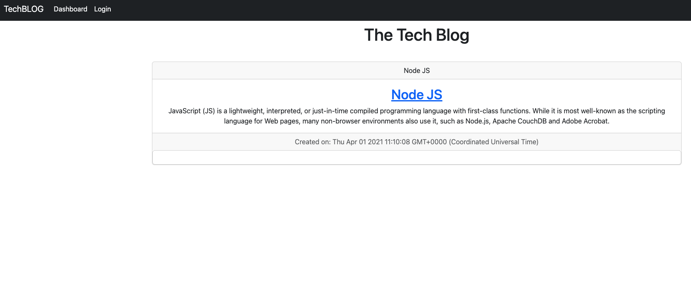

# Tech Blog Site CMS

## Description 
This is a CMS-style blog site for tech developers who want to publish articles, blog posts, and their thoughts and opinions. This site provides a user-friendly interface for managing posts, comments, and user accounts.

## Link
Link to deployed application on HEROKU.
>https://intense-river-83466.herokuapp.com/

## Table of Contents
  
  * [Installation](#installation)

  * [Technologies](#technologies)

  * [Screenshot](#screenshot)
  
  * [Usage](#usage)
  
  * [Contributing](#contributing)
  
  * [Test](#test)
  
  * [Questions](#questions)

  ## Installation
  To install necessary dependencies and start application run the following command:
  
     db folder⬇️
     
     mysql -u root -p

     source schema.sql

     root folder⬇️
     
     npm i

     npm run seed

     npm start

## Technologies
1. Javascript
2. NodeJs
3. Express
4. MySql

##  Node modules
     bcrypt
     connect-session-sequelize
     dotenv
     express
     express-handlebars
     express-session
     handlebars
     mysql2
     sequelize

## Screenshot

## Usage
When you visit the site for the first time, you will be presented with the homepage, which includes existing blog posts if any have been posted, navigation links for the homepage and the dashboard, and the option to log in. If you click on the homepage option, you will be taken to the homepage.

If you click on any other links in the navigation, you will be prompted to either sign up or sign in. If you choose to sign up, you will be prompted to create a username and password. When you click on the sign-up button, your user credentials will be saved, and you will be logged into the site.

When you revisit the site at a later time and choose to sign in, you will be prompted to enter your username and password. If you are signed in to the site, you will see navigation links for the homepage, the dashboard, and the option to log out.

If you click on the homepage option in the navigation, you will be taken to the homepage and presented with existing blog posts that include the post title and the date created. If you click on an existing blog post, you will be presented with the post title, contents, post creator’s username, and date created for that post and have the option to leave a comment.

When you enter a comment and click on the submit button while signed in, the comment will be saved, and the post will be updated to display the comment, the comment creator’s username, and the date created.

If you click on the dashboard option in the navigation, you will be taken to the dashboard and presented with any blog posts you have already created and the option to add a new blog post. If you click on the button to add a new blog post, you will be prompted to enter both a title and contents for your blog post. When you click on the button to create a new blog post, the title and contents of your post will be saved, and you will be taken back to an updated dashboard with your new blog post.

If you click on one of your existing posts in the dashboard, you will be able to delete or update your post and taken back to an updated dashboard. If you click on the logout option in the navigation, you will be signed out of the site.

If you are idle on the site for more than a set time, you will be able to view comments, but you will be prompted to log in again before you can add, update, or delete comments.

## Contributing

Contributing
Contributions are welcome! If you would like to contribute to this project, please fork the repository and submit a pull request.

## Support

- [MDN](https://developer.mozilla.org/en-US/) 

- [Google](https://Google.com)

## Questions

If you have any questions about this project, please feel free to reach out to me:
  
- [Contact - Full Stack Coder - Iaroslav Lasiichuk](mailto:lasiichuki@gmail.com)